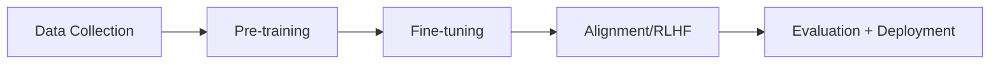
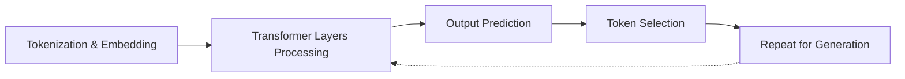

## What are Your LLM Best Practices?

<div style="display: grid; grid-template-columns: 1fr 360px; gap: 30px; align-items: center; max-width: 1000px; margin: 40px auto;">
<div>
<h3>Question for reflection:</h3>
<p style="font-size: 22px; line-height: 1.8;">
<strong>"What best practices have you discovered working with LLMs to get better outcomes?"</strong>
</p>
<p style="margin-top: 30px; font-size: 18px; color: #6b7280;">
Scan the QR code or visit:<br>
<strong>slido.com #4027 289</strong>
</p>
</div>
<div style="text-align: center;">

</div>
</div>

Note:
As you come in and get settled, take a moment to reflect on your own experiences. What techniques have you discovered on your own? This activates your existing knowledge and helps me understand where you're starting from.

---

## Session Roadmap

**What we'll cover today:**

<div style="font-size: 21px; line-height: 2; margin: 30px 0;">

1. How models work & differ — <span style="color: #6b7280;">25 min</span><br>
2. Hands-on: Multi-model prompting lab — <span style="color: #7c3aed;"><strong>50 min</strong></span><br>
3. Wrap & preview — <span style="color: #6b7280;">5 min</span>

</div>

<div style="margin-top: 30px; font-size: 20px; color: #15803d;">
Most of today is <strong>your hands on the keyboard</strong>, not me talking.
</div>

Note:
We did introductions on Tuesday, so today we get straight to work. Short lecture up front, then a full fifty minutes in the lab. I want you to have time to actually read what the models give you back - that's where the learning is. Last cohort rushed and it cost them.

---

## Today's Focus: Pr + Lg, Sm, Th

<div style="font-size: 14px; margin: 20px auto; max-width: 900px;">

| | Reactive | Retrieval | Orchestration | Validation | Models |
| --- | --- | --- | --- | --- | --- |
| **Primitives** | <span style="background: #e0e0e0; padding: 5px 10px; border-radius: 4px; display: inline-block;">Prompts (Pr)</span> | Embeddings | | | <span style="background: #e0e0e0; padding: 5px 10px; border-radius: 4px; display: inline-block;">LLMs (Lg)</span> |
| **Compositions** | Function Calling | Vector DBs | RAG | Guardrails | Multi-modal |
| **Deployment** | Agents | Fine-tuning | Frameworks | Red-teaming | <span style="background: #e0e0e0; padding: 5px 10px; border-radius: 4px; display: inline-block;">Small Models (Sm)</span> |
| **Emerging** | Multi-agent | Synthetic Data | | Interpretability | <span style="background: #e0e0e0; padding: 5px 10px; border-radius: 4px; display: inline-block;">Thinking Models (Th)</span> |

</div>

<div style="margin-top: 30px; font-size: 20px; color: #7c3aed; text-align: center;">
Today we focus on the <strong>Models family</strong> plus how to steer them with <strong>Prompts</strong>
</div>

Note:
These are elements from the AI Periodic Table. Highlighted in gray are what we'll cover today: Prompts (Row 1), and three types of models - Large Language Models (Row 1), Small Models (Row 3), and Thinking Models (Row 4). Everything else builds from these foundations.

---

## How LLMs Work: Tokens

- Tokens are the basic units of text that LLMs process, similar to how words work in human language.
- A token can be a whole word, part of a word, or even a single character
- LLMs read input and generate output by processing sequences of these tokens

;;;

### For Example

- Tokenization -> "Token" + "ization"
- Understanding -> "under" + "standing"
- Hello World! -> "hello" + "world" + "!"

;;;

### Tokens Not Standardized

- Different providers use different tokenization algorithms like BPE (Byte Pair Encoding), WordPiece, or SentencePiece.
- The choice depends on factors like the languages they want to support, desired vocabulary size (typically 30K-100K tokens), computational efficiency, and how well it handles rare words or multiple languages.

Note:
**BPE (Byte Pair Encoding):** Iteratively merges the most frequently occurring pairs of characters or tokens in the training data to build up a vocabulary from individual characters to common subwords.
**WordPiece:** Similar to BPE but chooses merges based on which pair maximizes the likelihood of the training data, rather than just raw frequency.
**SentencePiece:** Treats text as raw Unicode characters (no pre-tokenization needed) and applies algorithms like BPE or unigram, making it language-agnostic and able to handle spaces as regular characters.

;;;

### Why This Matters

You're billed per token, not per word

Note:
This is how LLMs actually see text. They don't see whole words - they break everything into subword pieces called tokens. Common prefixes, suffixes, and roots get their own tokens. This lets models understand new words they've never seen by recognizing familiar pieces.

---

## How LLMs Work: Training & Prediction



;;;

**High-level LLM Training Process:**

1. **Data Collection:** Gather massive amounts of text data from the internet, books, code repositories, etc. and clean/filter it

2. **Pre-training:** Train the model to predict the next token in sequences, learning language patterns, facts, and reasoning abilities from billions of examples

;;;

3. **Fine-tuning (Optional):** Further train on specific datasets for particular tasks like instruction-following or conversation

4. **Alignment (RLHF):** Use human feedback to teach the model to be helpful, harmless, and honest—reinforcing desired behaviors and reducing unwanted ones

;;;

5. **Evaluation & Deployment:** Test the model on benchmarks, safety checks, and real-world scenarios before releasing it

---

## What Happens When You "Talk" to an LLM



;;;

**What Happens When Text is Sent to an LLM:**

1. **Tokenization & Embedding:** The input text is split into tokens, then each token is converted into a numerical vector (embedding) that the neural network can process

2. **Transformer Layers Processing:** The embeddings pass through multiple transformer layers, where attention mechanisms identify relationships between tokens and feedforward networks transform the representations

;;;

## This repeats until complete

3. **Output Prediction:** The final layer produces a probability distribution over all possible next tokens in the "vocabulary"

4. **Token Selection:** The model selects the next token based on probability algorithm

5. **Repeat for Generation:** The newly generated token is added to the input sequence, and steps 2-4 repeat until the model generates a complete response or hits a stopping condition

---

## Different Models Have Different "Sizes"

Some models are 'small' and some models are 'large'

;;;

## Size & Parameters

- **Parameters** - The numerical values (numbers) in the neural network that are learned during training. They determine how the model processes information and what patterns it recognizes.

- **Size** - Refers to the total count of these parameters (e.g., 70B = 70 billion parameters). More parameters = larger model file, more memory needed, slower inference.

Note:
Weights represent the learned transformations and relationships in the network, not specific tokens or concepts.
They're the numbers that define:
- How to convert token IDs into embeddings (embedding layer weights)
- How tokens should pay attention to each other (attention weights)
- How to transform information between layers (feedforward weights)
- What patterns, grammar rules, facts, and reasoning steps to apply
They don't directly "mean" anything human-readable—they're just mathematical values that, when combined through billions of calculations, produce intelligent behavior. The model learned these specific numbers by adjusting them during training to minimize prediction errors.

;;;

## Why this Matters

- Larger open-weight models (e.g. **GPT-OSS-120B**) are generally more capable but require expensive GPUs, cost more to run, and respond slower.
- Smaller open-weight models (e.g. **GPT-OSS-20B**) are faster, cheaper, and can run on consumer hardware but are less capable.

;;;

## A Caveat You Need to Carry

**Nobody publishes parameter counts for the frontier models anymore.**

Anthropic, OpenAI, and Google do not disclose how big Claude, GPT, or Gemini are.

<div style="margin-top: 30px; font-size: 20px; color: #7c3aed;">
So use <strong>price and latency</strong> as your observable proxies for "size."<br>
A model that costs 25x more per output token is telling you something.
</div>

Note:
This is important and it trips people up. You'll read "GPT is a trillion parameters" on the internet - that's a rumor, not a spec sheet. The only models with published parameter counts are the open-weight ones you can download, like the GPT-OSS family. For everything else, the price sheet is the closest thing you get to a size chart. Expensive and slow usually means big. Cheap and fast usually means small or heavily distilled.

;;;

## In General

- You'd use a massive model for complex reasoning tasks, but a smaller model works fine for simple tasks like classification or when you need real-time responses.
- It's about balancing performance, cost, and speed.

---

## Model Categories: Size vs Capability

<div style="font-size: 17px; line-height: 1.6; margin: 20px 0;">

| Category | What it means | Examples (Aug 2026) | Strengths | Weaknesses |
|----------|---------------|---------------------|-----------|------------|
| **Frontier** | Top of a lab's lineup | Claude Opus 5, GPT-5.6 | Best reasoning, complex tasks | Expensive, slower |
| **Balanced** | The everyday workhorse | Claude Sonnet 5, GPT-5.4 | Good quality, reasonable cost | Not best at everything |
| **Fast/Small** | Cheap enough to run at volume | Claude Haiku 4.5, Gemini 3.7 Flash, GPT-OSS-20B | Very fast, very cheap | Less capable on hard tasks |
| **Thinking** | Reasons before it answers | Claude Fable 5, GPT-5.4 Pro | Extended reasoning | Very expensive, very slow |

</div>

<div style="margin-top: 30px; font-size: 19px; color: #7c3aed;">
<strong>Key insight:</strong> You can't just use the biggest model for everything - cost & speed matter
</div>

Note:
This framework helps you categorize models, and the framework outlives any specific name in that Examples column. Frontier models are the most capable but expensive. Balanced models hit a sweet spot for most tasks. Fast models are great for high-volume simple tasks. Thinking models spend extra compute reasoning before they answer - on some of these, like Fable 5, the thinking is always on and you can't turn it off. Note how fast that Examples column ages: every model in it is newer than this course's first offering, eight months ago. Learn the categories, not the names.

;;;

## Model Pricing: August 2026

<div style="font-size: 14px; margin: 20px 0;">

| Provider | Model | Category | Input (per 1M) | Output (per 1M) | Use Case |
|----------|-------|----------|----------------|-----------------|----------|
| **OpenAI** | GPT-5.4 Pro | Thinking | $30.00 | $180.00 | Deep research, hardest problems |
| **Anthropic** | Claude Fable 5 | Thinking | $10.00 | $50.00 | Long-horizon reasoning |
| **Anthropic** | Claude Opus 5 | Frontier | $5.00 | $25.00 | Technical precision, long documents |
| **OpenAI** | GPT-5.6 | Frontier | $4.00 | $20.00 | Complex reasoning, creative writing |
| **OpenAI** | GPT-5.4 | Balanced | $2.50 | $15.00 | General purpose |
| **Anthropic** | Claude Sonnet 5 | Balanced | $2.00 | $10.00 | Best quality/cost balance |
| **Anthropic** | Claude Haiku 4.5 | Fast | $1.00 | $5.00 | High-volume, speed-critical |
| **Google** | Gemini 3.7 Flash | Fast | $0.75 | $3.75 | High volume, multimodal |
| **Groq** | GPT-OSS-120B | Fast | $0.15 | $0.60 | Fast inference, open weights |

</div>

<div style="margin-top: 20px; font-size: 18px; color: #6b7280;">
<strong>Note:</strong> Published list prices as of Aug 31, 2026. Batch processing offers 50% discounts on most providers. <em>Check the price sheet yourself before you quote a number - this table will be wrong by Thanksgiving.</em>
</div>

Note:
This is real current pricing, pulled the week before class. Look at the spread: GPT-5.4 Pro costs three hundred times what GPT-OSS-120B costs per output token. Three hundred. But Pro is worth it when you need maximum quality on a hard problem. For your semester projects you'll learn to mix models - frontier for the critical content, fast models for bulk operations. Batch processing cuts costs in half if you're not in a rush. And notice the date on this slide: last spring's version of this deck said January 2026 and every single row on it is now obsolete. Pricing and model lineups turn over about every quarter. Get in the habit of checking.

---

## Prompting: The Other Half of the Equation

<div style="display: grid; grid-template-columns: 1fr 1fr; gap: 40px; margin: 40px 0;">

<div style="background: #fef3c7; padding: 30px; border-radius: 10px;">
<h3 style="color: #92400e;">The Model</h3>
<ul style="font-size: 17px; line-height: 1.8;">
<li>Parameters & training data</li>
<li>Speed & cost characteristics</li>
<li>Baseline capabilities</li>
</ul>
<p style="margin-top: 20px; color: #92400e;"><strong>What the model brings</strong></p>
</div>

<div style="background: #dbeafe; padding: 30px; border-radius: 10px;">
<h3 style="color: #1e3a8a;">The User</h3>
<ul style="font-size: 17px; line-height: 1.8;">
<li>Prompt engineering skills</li>
<li>Domain knowledge</li>
<li>Ability to iterate & refine</li>
</ul>
<p style="margin-top: 20px; color: #1e3a8a;"><strong>What you bring</strong></p>
</div>

</div>

<div style="text-align: center; font-size: 22px; color: #7c3aed; margin-top: 20px;">
<strong>Both matter!</strong> A great prompt on a weak model beats a bad prompt on a strong model
</div>

Note:
This is crucial to understand. The model is only half the equation. Your skill as a prompter - how you frame the task, provide context, show examples - is equally important. You can get amazing results out of Haiku with expert prompting, and terrible results out of Opus 5 with lazy prompting. Today's lab teaches you the prompting half.

---

## Prompt Engineering Principles

1. Be clear and direct
2. Use examples
3. Invite participation
4. Use Chains of Thought (CoT)
5. Separate instruction from Data
6. Use roles
7. Tweak parameters

Note:
These seven work across every model - they're not tricks for one product. We'll practice six of them in the lab in a few minutes; the seventh, tweaking parameters, is your take-home. Two to flag now: chain-of-thought makes the model show its reasoning, which usually improves accuracy on anything with constraints in it. And inviting participation - asking the model to interview you - is the one most people never try and the one that changes output the most.

---

## You Have Three Ways In

<div style="display: grid; grid-template-columns: repeat(3, 1fr); gap: 24px; margin: 36px 0; font-size: 16px;">

<div style="background: #ede9fe; padding: 24px; border-radius: 10px;">
<h4 style="color: #5b21b6; margin-top: 0;">Claude.ai Team</h4>
<p>Your own seat. Where you'll live for most of the semester - Projects, Skills, Connectors.</p>
</div>

<div style="background: #dbeafe; padding: 24px; border-radius: 10px;">
<h4 style="color: #1e3a8a; margin-top: 0;">Your API keys</h4>
<p>Anthropic + OpenAI, issued to you. For anything you build in code or automate.</p>
</div>

<div style="background: #fef3c7; padding: 24px; border-radius: 10px;">
<h4 style="color: #92400e; margin-top: 0;">Course LibreChat</h4>
<p>Many providers behind one interface. <strong>Best tool for side-by-side comparison</strong> - which is exactly today.</p>
</div>

</div>

<div style="display: grid; grid-template-columns: 1fr 300px; gap: 30px; align-items: center; max-width: 1000px; margin: 20px auto;">
<div>
<h3 style="margin-top: 0;">Today we're in LibreChat:</h3>
<a href="https://msu-ai.superwebpros.com/">https://msu-ai.superwebpros.com</a>
</div>
<div style="text-align: center;">

</div>
</div>

Note:
Big change from the pilot cohort: you each have your own Claude.ai Team seat and your own Anthropic and OpenAI API keys. LibreChat is not the only door anymore, and from Session 3 onward most of your work moves to Claude.ai. But for today LibreChat is still the right tool, because it's the one place you can run the same prompt against models from different providers and see them next to each other. Let me demo switching models, and I'll come back to comparison mode a bit later.

---

## Hands-On: Multi-Model Prompting Lab

**Now it's time to experiment — 50 minutes:**

<div style="margin-top: 40px; font-size: 22px; color: #7c3aed;">
<strong>Goal:</strong> Develop intuition for model selection and prompting strategies
</div>

<div style="margin-top: 30px; font-size: 19px; color: #15803d;">
<strong>Read the outputs.</strong> Actually read them. That's the assignment.
</div>

Note:
This is individual work in LibreChat, structured exercises adapted from Anthropic's prompt engineering tutorial. One thing I want to say up front: do not race. The cohort that took this last spring got the most out of it when they slowed down and actually read what came back. If you finish an exercise early, go deeper on it rather than jumping ahead.

;;;

## Three Models. One Per Category.

<div style="font-size: 19px; margin: 30px auto; max-width: 880px;">

| Category | Model | Why it's here |
|----------|-------|---------------|
| **Frontier** | Claude Opus 5 | Ceiling of what's possible right now |
| **Balanced** | GPT-5.4 | Different lab, mid-tier — isolates *provider* from *tier* |
| **Fast** | Claude Haiku 4.5 | Cheap and quick — is it good enough? |

</div>

<div style="margin-top: 24px; font-size: 18px; color: #6b7280;">
<strong>Finished early?</strong> Add <strong>Claude Sonnet 5</strong> — it completes the Anthropic ladder (Opus → Sonnet → Haiku) so you can see tier effects with the provider held constant.
</div>

<div style="margin-top: 20px; font-size: 17px; color: #92400e;">
If a name in the dropdown doesn't match exactly, pick the nearest model in that category and note which one you used.
</div>

Note:
Three models, not six. Last cohort tried six and it was too many - people were still reading model four when we needed to move on. Three is enough to see the pattern. The comparison you care about is across the categories, not between two specific product names. And write down which models you actually used, because your reflection needs to name them.

;;;

## Example Case Study

You are a marketing consultant who just signed a local Pilates studio as a client. Our goal is to help them generate a plan to scale their business.

;;;

## Exercise 1: Zero-Shot Baseline

> Principle: Be clear and direct

What to observe:

- Which model is fastest?
- Which model provides the most helpful answer?
- Which model provides the most over-confident answer?
- Which model provides the least helpful answer?

;;;

### Exercise 1

#### Prompt
```
Generate a marketing plan for local Pilates studio.
```

<div style="background: #fef3c7; padding: 18px 24px; border-radius: 8px; margin-top: 24px; font-size: 18px;">
<strong>Run these one at a time.</strong> Opus 5, then GPT-5.4, then Haiku 4.5 — three separate chats. Yes, it's tedious. That's deliberate.
</div>

---

## Exercise 2

> Principle: Be clear and direct

What to observe:

- How does bounding the 'set' of possibilities impact the result?

;;;

### Exercise 2

> Note: start a new 'chat' session (don't use the one you were already using)

#### Prompt

```
Generate a marketing plan for local Pilates studio. Only give me solutions I can self-implement for less than $2,000/month
```

<div style="background: #fef3c7; padding: 18px 24px; border-radius: 8px; margin-top: 24px; font-size: 18px;">
Still one at a time. Same three models: <strong>Opus 5 → GPT-5.4 → Haiku 4.5</strong>.
</div>

---

## Stop. There's a Faster Way.

<div style="max-width: 900px; margin: 40px auto; font-size: 21px; line-height: 1.8;">

You just ran the same prompt six times by hand.

LibreChat has a **comparison mode** that fans one prompt out to several models at once and shows you the answers side by side.

</div>

<div style="margin-top: 30px; font-size: 20px; color: #7c3aed;">
Use it for the rest of the lab.
</div>

<div style="margin-top: 30px; font-size: 18px; color: #6b7280;">
So why did I make you do it the slow way first?
</div>

Note:
I withheld this on purpose, and I'm telling you that I withheld it. If I'd shown you comparison mode at the top of the hour, you'd have skimmed three columns of text and learned nothing about how any individual model behaves. Running them one at a time forces you to sit with each answer on its own terms. Now that you've felt the tedium, the efficiency is obvious and you've still got the habit of reading carefully. That's the trade. This worked well with last spring's cohort and I'm doing it again.

---

## Exercise 3

> Principle: Use Chains of Thought/Planning

What to observe:

- How do the models change when you ask it to think or plan?
- Which model(s) change the most? The least? Why do you suppose that is?

;;;

### Exercise 3

#### Prompt
```
Generate a marketing plan for my local Pilates studio. Think step-by-step through the time and money constraints I may have. Then, give me a plan I can self-implement for less than $2,000/month. Justify your reasoning.
```

Models to use — **comparison mode**:

- Claude Opus 5 · GPT-5.4 · Claude Haiku 4.5

---

## Exercise 4

> Principle: Invite Participation

What to observe

- How does working with an LLM vs "using" an LLM change the output?

;;;

### Exercise 4

#### Prompt
```
I need to generate a marketing plan for my local Pilates studio. I would like you to help me put it together. Please ask me questions to answer so that I can get a high-quality personalized plan for my studio.
```

Models to use — **comparison mode**:

- Claude Opus 5 · GPT-5.4 · Claude Haiku 4.5

---

## Exercise 5

> Principles: Use Examples, Separate Instruction from Data

What to observe:

- How do examples affect the outcome of what's generated?

;;;

### Exercise 5a

#### Prompt
```
I am offering a new member 30-day $7 trial for my new pilates studio to bring people in for the back-to-school season. Please write me a Facebook ad for this offer.
```

Models to use — **comparison mode**:

- Claude Opus 5 · GPT-5.4 · Claude Haiku 4.5

;;;

### Exercise 5b

### Prompt
```
I am offering a new member 30-day $7 trial for my new pilates studio to bring people in for the back-to-school season. Please write me a Facebook ad for this offer. Use a tone based on the following examples:
<example>
Try the low-impact fitness method Jennifer Aniston calls a “game-changer.”

✨ “Within weeks I felt stronger, leaner, and my back pain started to fade. This is the only workout I’ve stuck with.” – Amanda K.

✅ Joint-friendly, results you can see and feel
✅ Functional, Pilates-inspired movements that sculpt head to toe
✅ Clinically proven to reduce lower back pain

👉 Get started risk-free for 30 days with a new-member bundle. Love it or send it back for a full refund.
</example>
<example>
Did you know only 6% of sports science research focuses on women? 🤯

That’s why Pvolve ran clinical studies of our own — and the results speak for themselves:

✨ +23% more daily energy
✨ +21% more flexibility
✨ +19% more hip strength & function

And members also saw:
💪 Stronger balance & mobility
🔥 Lean muscle (without bulk)
❤️ Healthier blood markers
🌟 Better overall quality of life

The best part? Every bundle comes with a 30-day money-back guarantee. Don’t love it? Send it back—on us.
</example>
<example>
Too busy to workout? Pvolve makes it easy. Transform your body in 30 minutes a day with the low-impact method everyone’s talking about.

💪 Total-Body Sculpting From Home
🏋️ Functional, Pilates-Inspired Movements
🧠 Backed by Clinical Research
🌟 Loved by Jennifer Aniston

👉 Try any bundle risk-free for 30 days — streaming included.
</example>
```

Models to use — **comparison mode**:

- Claude Opus 5 · GPT-5.4 · Claude Haiku 4.5

---

## Exercise 6 — Optional / Take-Home

<div style="background: #f3f4f6; border-left: 5px solid #6b7280; padding: 20px 28px; margin: 30px auto; max-width: 900px; font-size: 19px;">
We are <strong>not</strong> doing this one in class. It's here so you can run it on your own — and it's a good thing to reference in your reflection.
</div>

> Principle: Tweak parameters

What to observe:

- How does temperature affect the quality and tone of response?
- Are some models more sensitive than others?

_Note: turn off thinking/reasoning to see this in effect_

Note:
Straight talk: this exercise did not fit in eighty minutes last time and I'm not going to pretend it does. It's genuinely interesting, so I'm giving it to you as a take-home instead of rushing exercises 1 through 5 to squeeze it in. If you run it, bring it up in your reflection.

;;;

### Exercise 6a/b

### Prompt
```
I am offering a new member 30-day $7 trial for my new pilates studio to bring people in for the back-to-school season. Please write me a Facebook ad for this offer.
```

Temperatures to use: 1, 0.2

Models to use:

- Claude Opus 5 · GPT-5.4 · Claude Haiku 4.5

---

## Exercise 7 — Back in the Room

> Principle: Use Roles

What to observe:

- How do 'roles' make it "easier" for an LLM to get to an outcome faster?
- How do 'roles' reduce your work as a human?

;;;

### Exercise 7

#### Role Prompt
```
You are an expert Facebook ad copywriter. You use best practices as exemplified by these examples to craft high-quality ads for local pilates studios:
<example>
Try the low-impact fitness method Jennifer Aniston calls a “game-changer.”

✨ “Within weeks I felt stronger, leaner, and my back pain started to fade. This is the only workout I’ve stuck with.” – Amanda K.

✅ Joint-friendly, results you can see and feel
✅ Functional, Pilates-inspired movements that sculpt head to toe
✅ Clinically proven to reduce lower back pain

👉 Get started risk-free for 30 days with a new-member bundle. Love it or send it back for a full refund.
</example>
<example>
Did you know only 6% of sports science research focuses on women? 🤯

That’s why Pvolve ran clinical studies of our own — and the results speak for themselves:

✨ +23% more daily energy
✨ +21% more flexibility
✨ +19% more hip strength & function

And members also saw:
💪 Stronger balance & mobility
🔥 Lean muscle (without bulk)
❤️ Healthier blood markers
🌟 Better overall quality of life

The best part? Every bundle comes with a 30-day money-back guarantee. Don’t love it? Send it back—on us.
</example>
<example>
Too busy to workout? Pvolve makes it easy. Transform your body in 30 minutes a day with the low-impact method everyone’s talking about.

💪 Total-Body Sculpting From Home
🏋️ Functional, Pilates-Inspired Movements
🧠 Backed by Clinical Research
🌟 Loved by Jennifer Aniston

👉 Try any bundle risk-free for 30 days — streaming included.
</example>
```

Models to use — **comparison mode**:

- Claude Opus 5 · GPT-5.4 · Claude Haiku 4.5

Note:
This one goes in the system prompt field, not the chat box - that's the whole point of a role. Then send a plain one-line request as your user message and notice how much less you had to say to get a good ad. Flag me down if you can't find where the system prompt lives in LibreChat.

---

## Key Takeaways

**Model Selection:**
- Models come in categories: Frontier, Balanced, Fast, Thinking
- Parameters = learned patterns stored in the model — and for frontier models, nobody publishes the count
- Pricing varies **300x** across the table we looked at — match model to task complexity
- The categories are durable. The model names are not.

;;;

**Prompting Principles You Practiced:**
- Be clear and direct
- Use examples (few-shot learning)
- Invite participation - work WITH the model
- Use chains of thought for complex reasoning
- Separate instructions from data
- Assign roles to shape responses
- Tweak parameters (temperature) for creativity vs consistency — *your take-home*

> Prompting matters as much as model choice


Note:
These are the core lessons from today. You now understand how to choose models strategically AND how to get better results through effective prompting. Six of these seven you practiced in the room; the temperature one is yours to run on your own. All seven work across every model and they're the foundation for the rest of the course.

---

## Preview: Session 3 - Claude Projects

**Tuesday, September 8:**

<div style="font-size: 20px; line-height: 2; margin: 40px 0;">

**Claude Projects** - persistent context you build once and reuse<br>
Give a model your documents, your instructions, your standing context<br>
Hands-on: start the <strong>Project for your own résumé & career coaching</strong>

</div>

<div style="margin-top: 30px; font-size: 19px; color: #6b7280;">
This is the start of <strong>Milestone 1</strong> — due Session 6, Sep 17.
</div>

<div style="margin-top: 30px; font-size: 22px; color: #15803d;">
Today: steering models • Next: giving them memory
</div>

Note:
Today you learned to steer models with prompts. But every chat you opened today started from nothing - the model has no idea who you are or what you told it an hour ago. Next session we fix that with Claude Projects: you load in documents and standing instructions once, and every conversation in that Project starts from there. And you're not building a toy - you're building the career-coaching system for yourself, with your own résumé in it. That Project is Milestone 1, due Session 6. Bring your résumé, and anything else that describes your work - portfolio, writing samples, job descriptions you're interested in.

---

## Bring to Session 3

**On your laptop, Tuesday:**

<div style="font-size: 20px; line-height: 2; margin: 30px 0;">

- Your **résumé** (current version, any format)
- Any **writing samples** or portfolio pieces
- 2-3 **job postings** you'd actually want
- Your Claude.ai Team login, working

</div>

Note:
Please don't show up Tuesday planning to write your résumé during class. Bring what you have, even if it's rough - rough is fine, the Project will help you improve it. And confirm your Claude.ai Team seat works before Tuesday. Email me tonight if it doesn't.

---

## Deliverable: Class Learnings

**Due before Session 3 (Tuesday, Sep 8):**

- Reflection: **Session 2 - Prompting & Model Selection**

Note:
Focus on why models behave differently, not just which one you prefer. Name the specific models you tested. Evidence of trying multiple strategies. Clear reasoning about tradeoffs. This is your first individual deliverable.
