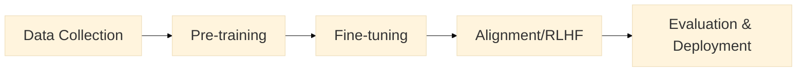

<h1 style="font-size: 2.5rem; margin-bottom: 1rem;">Session 2: Prompts & Language Models</h1>

<h2 style="font-size: 1.8rem; margin-bottom: 1rem;">SSC 493: AI Workflows & Organizational Intelligence</h2>

Spring 2026 • Michigan State University

Note:
Welcome to Session 2. Today we're diving into the first two primitives from the AI Periodic Table: Pr (Prompts) and Lg (Language Models). By the end of today, you'll understand how different models behave differently and how to steer them effectively.

---

## What are Your LLM Best Practices?

<h3>Question for reflection:</h3>

<strong>"What best practices have you discovered working with LLMs to get better outcomes?"</strong>

Scan the QR code or visit: 
<strong>slido.com #4027 289</strong>

Note:
As you come in and get settled, take a moment to reflect on your own experiences. What techniques have you discovered on your own? This activates your existing knowledge and helps me understand where you're starting from.

---

## Session Roadmap

**What we'll cover today:**

1. Get to know each of you a bit
2. How models work & differ
3. Hands-on: Multi-model prompting lab
4. Wrap & preview

Note:
Today's packed with hands-on work. We'll start by getting to know each other, then dive into understanding how models work, and spend most of our time experimenting with different prompting strategies across multiple models.

---

## Get to Know Each Other

**Let's go around the room - share briefly:**

1. Your name
2. Where you're from
3. Your major
4. What is your ideal post-grad job?

Note:
This is informal - just want to get a sense of who everyone is and where you're headed. We'll be working together all semester, so let's start building that rapport.

---

## Today's Focus: Pr + Lg, Sm, Th

| | Reactive | Retrieval | Orchestration | Validation | Models |
| --- | --- | --- | --- | --- | --- |
| **Primitives** | Prompts (Pr) | Embeddings | | | LLMs (Lg) |
| **Compositions** | Function Calling | Vector DBs | RAG | Guardrails | Multi-modal |
| **Deployment** | Agents | Fine-tuning | Frameworks | Red-teaming | Small Models (Sm) |
| **Emerging** | Multi-agent | Synthetic Data | | Interpretability | Thinking Models (Th) |

Today we focus on the <strong>Models family</strong> plus how to steer them with <strong>Prompts</strong>

Note:
These are elements from the AI Periodic Table. Highlighted in gray are what we'll cover today: Prompts (Row 1), and three types of models - Large Language Models (Row 1), Small Models (Row 3), and Thinking Models (Row 4). Everything else builds from these foundations.

---

## How LLMs Work: Tokens

- Tokens are the basic units of text that LLMs process, similar to how words work in human language.
- A token can be a whole word, part of a word, or even a single character
- LLMs read input and generate output by processing sequences of these tokens

;;;

### For Example

- Tokenization -> "Token" + "ization"
- Understanding -> "under" + "standing"
- Hello World! -> "hello" + "world" + "!"

;;;

### Tokens Not Standardized

- Different providers use different tokenization algorithms like BPE (Byte Pair Encoding), WordPiece, or SentencePiece.
- The choice depends on factors like the languages they want to support, desired vocabulary size (typically 30K-100K tokens), computational efficiency, and how well it handles rare words or multiple languages.

Note:
**BPE (Byte Pair Encoding):** Iteratively merges the most frequently occurring pairs of characters or tokens in the training data to build up a vocabulary from individual characters to common subwords.
**WordPiece:** Similar to BPE but chooses merges based on which pair maximizes the likelihood of the training data, rather than just raw frequency.
**SentencePiece:** Treats text as raw Unicode characters (no pre-tokenization needed) and applies algorithms like BPE or unigram, making it language-agnostic and able to handle spaces as regular characters.

;;;

### Why This Matters

You're billed per token, not per word

Note:
This is how LLMs actually see text. They don't see whole words - they break everything into subword pieces called tokens. Common prefixes, suffixes, and roots get their own tokens. This lets models understand new words they've never seen by recognizing familiar pieces.

---

## How LLMs Work: Training & Prediction

;;;

**High-level LLM Training Process:**

1. **Data Collection:** Gather massive amounts of text data from the internet, books, code repositories, etc. and clean/filter it

2. **Pre-training:** Train the model to predict the next token in sequences, learning language patterns, facts, and reasoning abilities from billions of examples

3. **Fine-tuning (Optional):** Further train on specific datasets for particular tasks like instruction-following or conversation

4. **Alignment (RLHF):** Use human feedback to teach the model to be helpful, harmless, and honest—reinforcing desired behaviors and reducing unwanted ones

5. **Evaluation & Deployment:** Test the model on benchmarks, safety checks, and real-world scenarios before releasing it

;;;

graph LR
    A[Input: The cat sat on] --> B[Neural Network Billions of Parameters]
    B --> C{Probability Distribution}
    C --> D1[the: 35%]
    C --> D2[a: 20%]
    C --> D3[my: 15%]
    C --> D4[her: 12%]
    C --> D5[...: 18%]
    style B fill:#e0e0ff
    style C fill:#ffe0e0

**Training:** Model learns patterns from billions of text examples
**Parameters:** The "knobs" that store learned patterns (billions of them)
**Prediction:** Given input, model predicts most likely next token

LLMs don't "know" things - they predict likely continuations based on patterns

Note:
This neural network diagram shows the core process. Input text flows through billions of parameters (the model's "learned patterns"), which output probabilities for what token should come next. The model picks from that probability distribution. It's not looking up facts - it's predicting based on statistical patterns it learned during training.

---

## What Are Parameters?

**Parameters = the "weights" that store what the model learned**

Think of parameters like knobs on a massive mixing board:
- Each knob slightly adjusts how the model processes text
- More parameters = more nuance and capability (but slower & more expensive)

**Model sizes:**
- **GPT-4o:** ~200 billion parameters
- **Claude Haiku:** ~20 billion parameters
- **Llama 3.3 70B:** 70 billion parameters

**Concrete example:**
The parameter that connects "doctor" → "hospital" has a high weight
The parameter that connects "doctor" → "spaceship" has a low weight

Note:
Parameters are literally numbers (weights) in the neural network. During training, these weights get adjusted billions of times until the model learns useful patterns. More parameters means the model can store more complex patterns, but it also means slower responses and higher costs to run.

---

## Model Categories: Size vs Capability

| Category | Parameter Range | Examples | Strengths | Weaknesses |
|----------|----------------|----------|-----------|------------|
| **Frontier** | 120B+ | GPT-4o, Claude Opus | Best reasoning, complex tasks | Expensive, slower |
| **Balanced** | 20-70B | Claude Sonnet, Llama 70B | Good quality, reasonable cost | Not best at everything |
| **Fast/Small** | 7-20B | Claude Haiku, Gemini Flash | Very fast, very cheap | Less capable on hard tasks |
| **Thinking** | Varies | o1, Claude Thinking | Extended reasoning | Very expensive, very slow |

**Key insight:** You can't just use the biggest model for everything - cost & speed matter

Note:
This framework helps you categorize models. Frontier models are the most capable but expensive. Balanced models hit a sweet spot for most tasks. Fast models are great for high-volume simple tasks. Thinking models spend extra compute time reasoning through problems. The trap is thinking "just use GPT-4o for everything" - you'll blow your budget fast.

---

## How Models Are Evaluated

**Common benchmarks that compare model capabilities:**

**MMLU (Massive Multitask Language Understanding):**
Tests knowledge across 57 subjects (math, history, law, etc.)

**HumanEval:**
Tests ability to write correct code from descriptions

**MT-Bench:**
Tests conversation quality and following instructions

**LMSYS Chatbot Arena:**
Real humans vote on which model gives better responses

Frontier models score 85-90% on these. Fast models score 70-80%.

Note:
These benchmarks help us compare apples to apples. MMLU tests broad knowledge. HumanEval tests coding ability. MT-Bench tests how well models follow complex instructions. The Arena is interesting - it's real people blind-voting between responses. This is why we can say "Claude Opus and GPT-4o are comparable" - they score similarly on these benchmarks.

---

## Why Not Just Use The Best Model?

**Let's do the math on a real project:**

**Scenario:** Generate product descriptions for 10,000 products
**Input:** 200 tokens per product (product specs)
**Output:** 300 tokens per description

**Cost with GPT-5.2 (Frontier):**
Input: 10K × 200 tokens × $1.75/1M = **$3.50**
Output: 10K × 300 tokens × $14.00/1M = **$42.00**
**Total: $45.50**

**Cost with Gemini 2.0 Flash (Fast):**
Input: 10K × 200 tokens × $0.10/1M = **$0.20**
Output: 10K × 300 tokens × $0.40/1M = **$1.20**
**Total: $1.40**

<strong>32x cost difference</strong> - and for product descriptions, Gemini Flash is "good enough"

Note:
This is the real-world tradeoff. For creative or complex reasoning tasks, you need GPT-4o or Claude Opus. But for high-volume simple tasks like product descriptions, using a frontier model is wasteful. You'd pay 33x more for marginally better output. Smart model selection is about matching capability to task requirements.

---

## Model Pricing: January 2026

| Provider | Model | Category | Input (per 1M) | Output (per 1M) | Use Case |
|----------|-------|----------|----------------|-----------------|----------|
| **OpenAI** | GPT-5.2 | Frontier | $1.75 | $14.00 | Complex reasoning, creative writing |
| **OpenAI** | GPT-5 mini | Balanced | $0.25 | $2.00 | General purpose, cost-sensitive |
| **Anthropic** | Claude Opus 4.5 | Frontier | $5.00 | $25.00 | Technical precision, long documents |
| **Anthropic** | Claude Sonnet 4.5 | Balanced | $3.00 | $15.00 | Best quality/cost balance |
| **Anthropic** | Claude Haiku 4.5 | Fast | $1.00 | $5.00 | High-volume, speed-critical |
| **Google** | Gemini 2.0 Flash | Fast | $0.10 | $0.40 | Ultra-high volume, multimodal |
| **Groq** | Llama 3.3 70B | Balanced | $0.59 | $0.79 | Fast inference, open source |

<strong>Note:</strong> Prices current as of Jan 2026. Batch processing offers 50% discounts on most providers.

Note:
This is real current pricing. Notice the ranges - Claude Opus is 62x more expensive than Gemini Flash for output tokens ($25 vs $0.40). But Opus is worth it when you need maximum quality. For your semester projects, you'll learn to mix models - use frontier models for critical content, fast models for bulk operations. Batch processing can cut costs in half if you're not in a rush.

---

## Prompting: The Other Half of the Equation

<h3 style="color: #92400e;">The Model</h3>
<ul style="font-size: 17px; line-height: 1.8;">
<li>Parameters & training data</li>
<li>Speed & cost characteristics</li>
<li>Baseline capabilities</li>
</ul>

<strong>What the model brings</strong>

<h3 style="color: #1e3a8a;">The User</h3>
<ul style="font-size: 17px; line-height: 1.8;">
<li>Prompt engineering skills</li>
<li>Domain knowledge</li>
<li>Ability to iterate & refine</li>
</ul>

<strong>What you bring</strong>

<strong>Both matter!</strong> A great prompt on a weak model beats a bad prompt on a strong model

Note:
This is crucial to understand. The model is only half the equation. Your skill as a prompter - how you frame the task, provide context, show examples - is equally important. You can get amazing results from a small model with expert prompting, and terrible results from GPT-4o with lazy prompting. Today's lab teaches you the prompting half.

---

## Prompting Strategies: The Toolkit

**Three fundamental techniques you'll test today:**

1. **Zero-Shot:** Just ask directly
   - "Write a product description for noise-cancelling headphones"

2. **Few-Shot:** Show examples of what you want
   - Give 2-3 examples, then ask for more

3. **Chain-of-Thought (CoT):** Ask model to think step-by-step
   - "Think through this step by step..."

Note:
These three techniques work across all models. Zero-shot is fastest but least controlled. Few-shot guides the model with examples. Chain-of-thought makes the model show its reasoning, which often improves accuracy for complex tasks.

---

## Live Demo: Course LibreChat

<h3>Access your course AI workspace:</h3>

<strong>LibreChat gives you access to:</strong>  
• GPT-4o, GPT-4o Mini 
• Claude Opus, Sonnet, Haiku 
• Gemini 2.0 Flash 
• Groq Llama models

Scan QR code for login → 
Use your MSU credentials

LibreChat QR Code (TBD)

Note:
This is your AI workspace for the entire course. You have access to all major models in one place. No need to juggle multiple accounts or API keys. I'll demo how to switch between models and run the same prompt across different options.

---

## Hands-On: Multi-Model Prompting Lab

**Next 40 minutes - you'll experiment with:**

✅ LibreChat interface across 4+ models 
✅ Interactive workbook with 6-8 exercises 
✅ Testing zero-shot, few-shot, and chain-of-thought prompting 
✅ Comparing outputs across models 
✅ Submitting your observations

<strong>Goal:</strong> Develop intuition for model selection and prompting strategies

Note:
This is individual work. You'll get hands-on with LibreChat and complete structured exercises adapted from Anthropic's prompt engineering tutorial. The workbook will guide you through specific prompting challenges across multiple models.

---

## Workbook Structure

**You'll complete 6-8 exercises testing different strategies:**

1. **Being Clear and Direct** - Get models to skip preamble
2. **Output Control** - Strict formatting constraints
3. **Zero-Shot Classification** - Categorize customer emails
4. **Few-Shot Learning** - Same task with examples
5. **Chain-of-Thought** - Complex reasoning tasks
6. **Temperature Experiment** - Creativity vs accuracy

Minimum 4 exercises required • Submit via form before next session

Note:
Each exercise is designed to teach you something specific about prompting. You'll test the same prompts across multiple models and observe differences. This builds your intuition for when to use which model and which technique.

---

## Getting Started: LibreChat Setup

**Steps to begin:**

1. Open LibreChat (scan QR code from previous slide)
2. Verify you can access all 4 models
3. Get the interactive workbook (distributed now)
4. Start with Exercise 1

<strong>If you have tech issues:</strong> Raise your hand immediately - we'll troubleshoot

Note:
I'll be circulating to help with any technical issues and answer questions. Try to complete at least 4 exercises during class time. If you don't finish all 6-8, complete them before next session.

---

## Work Time: 40 Minutes

<h2 style="font-size: 3rem; color: #7c3aed;">🚀 Get started!</h2>

Experiment • Compare • Observe • Learn

Note:
I'll give you a 10-minute warning before we wrap up. Focus on learning, not just completing exercises. Pay attention to what works and what doesn't. These insights will serve you throughout the course.

---

## Debrief: What Did You Notice?

**Quick discussion - share your observations:**

- Which model surprised you the most?
- Which prompting strategy worked best?
- Any unexpected results?
- What would you use each model for?

Note:
Let's hear what you discovered. This is where individual observations become collective learning. What patterns emerged?

---

## Key Takeaways

✅ **Models come in categories** - Frontier, Balanced, Fast, Thinking

✅ **Parameters = learned patterns** - More isn't always better (cost/speed tradeoffs)

✅ **Benchmarks help compare models** - But real-world fit matters more

✅ **Pricing varies 62x** - Match model to task complexity

✅ **Prompting matters as much as the model** - Your skill is half the equation

✅ **Three core techniques** - Zero-shot, few-shot, chain-of-thought

Note:
These are the core lessons from today. You now understand model categories, what parameters actually are, how to evaluate models, and why pricing matters. Most importantly, you've practiced prompting strategies hands-on across multiple models.

---

## Preview: Session 3 - RAG & Custom GPTs

**Thursday we'll cover:**

📚 **Rg (RAG)** - Retrieval Augmented Generation 
🧠 How to give AI "memory" with your documents 
🛠️ Hands-on: Build a Custom GPT with your resume

Today: steering models • Next: giving them memory

Note:
Today you learned to steer models with prompts and understand their differences. But they don't remember things between conversations. Next session introduces RAG - how to upload your own documents and give AI access to specific knowledge. You'll build something immediately useful.

---

## Deliverable: Complete Workbook

**Due before Session 3:**

✅ Complete at least 4 of 6-8 workbook exercises 
✅ Test prompts across multiple models 
✅ Submit observations via form [link provided]

<strong>What we're looking for:</strong> Thoughtful analysis of model differences and prompting strategies - not just "this one is better"

Note:
Focus on why models behave differently, not just which one you prefer. Evidence of testing multiple strategies. Clear reasoning about tradeoffs. This is your first individual deliverable.

---

## Questions?

<h2 style="font-size: 2.5rem; color: #7c3aed;">See you Thursday!</h2>

Office hours: See syllabus 
Email: jesse@superwebpros.com

Note:
Great work today. You now have hands-on experience with multiple models and prompting strategies. Complete the workbook exercises and we'll dive into RAG next session.
