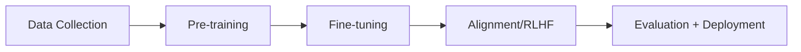
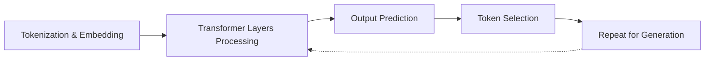

## What are Your LLM Best Practices?

<div style="display: grid; grid-template-columns: 1fr 360px; gap: 30px; align-items: center; max-width: 1000px; margin: 40px auto;">
<div>
<h3>Question for reflection:</h3>
<p style="font-size: 22px; line-height: 1.8;">
<strong>"What best practices have you discovered working with LLMs to get better outcomes?"</strong>
</p>
<p style="margin-top: 30px; font-size: 18px; color: #6b7280;">
Scan the QR code or visit:<br>
<strong>slido.com #4027 289</strong>
</p>
</div>
<div style="text-align: center;">

</div>
</div>

Note:
As you come in and get settled, take a moment to reflect on your own experiences. What techniques have you discovered on your own? This activates your existing knowledge and helps me understand where you're starting from.

---

## Session Roadmap

**What we'll cover today:**

1. Get to know each of you a bit
2. How models work & differ
3. Hands-on: Multi-model prompting lab
4. Wrap & preview

Note:
Today's packed with hands-on work. We'll start by getting to know each other, then dive into understanding how models work, and spend most of our time experimenting with different prompting strategies across multiple models.

---

## Get to Know Each Other

**Let's go around the room - share briefly:**

1. Your name
2. Where you're from
3. Your major
4. What is your ideal post-grad job?

Note:
This is informal - just want to get a sense of who everyone is and where you're headed. We'll be working together all semester, so let's start building that rapport.

---

## Today's Focus: Pr + Lg, Sm, Th

<div style="font-size: 14px; margin: 20px auto; max-width: 900px;">

| | Reactive | Retrieval | Orchestration | Validation | Models |
| --- | --- | --- | --- | --- | --- |
| **Primitives** | <span style="background: #e0e0e0; padding: 5px 10px; border-radius: 4px; display: inline-block;">Prompts (Pr)</span> | Embeddings | | | <span style="background: #e0e0e0; padding: 5px 10px; border-radius: 4px; display: inline-block;">LLMs (Lg)</span> |
| **Compositions** | Function Calling | Vector DBs | RAG | Guardrails | Multi-modal |
| **Deployment** | Agents | Fine-tuning | Frameworks | Red-teaming | <span style="background: #e0e0e0; padding: 5px 10px; border-radius: 4px; display: inline-block;">Small Models (Sm)</span> |
| **Emerging** | Multi-agent | Synthetic Data | | Interpretability | <span style="background: #e0e0e0; padding: 5px 10px; border-radius: 4px; display: inline-block;">Thinking Models (Th)</span> |

</div>

<div style="margin-top: 30px; font-size: 20px; color: #7c3aed; text-align: center;">
Today we focus on the <strong>Models family</strong> plus how to steer them with <strong>Prompts</strong>
</div>

Note:
These are elements from the AI Periodic Table. Highlighted in gray are what we'll cover today: Prompts (Row 1), and three types of models - Large Language Models (Row 1), Small Models (Row 3), and Thinking Models (Row 4). Everything else builds from these foundations.

---

## How LLMs Work: Tokens

- Tokens are the basic units of text that LLMs process, similar to how words work in human language.
- A token can be a whole word, part of a word, or even a single character
- LLMs read input and generate output by processing sequences of these tokens

;;;

### For Example

- Tokenization -> "Token" + "ization"
- Understanding -> "under" + "standing"
- Hello World! -> "hello" + "world" + "!"

;;;

### Tokens Not Standardized

- Different providers use different tokenization algorithms like BPE (Byte Pair Encoding), WordPiece, or SentencePiece.
- The choice depends on factors like the languages they want to support, desired vocabulary size (typically 30K-100K tokens), computational efficiency, and how well it handles rare words or multiple languages.

Note:
**BPE (Byte Pair Encoding):** Iteratively merges the most frequently occurring pairs of characters or tokens in the training data to build up a vocabulary from individual characters to common subwords.
**WordPiece:** Similar to BPE but chooses merges based on which pair maximizes the likelihood of the training data, rather than just raw frequency.
**SentencePiece:** Treats text as raw Unicode characters (no pre-tokenization needed) and applies algorithms like BPE or unigram, making it language-agnostic and able to handle spaces as regular characters.

;;;

### Why This Matters

You're billed per token, not per word

Note:
This is how LLMs actually see text. They don't see whole words - they break everything into subword pieces called tokens. Common prefixes, suffixes, and roots get their own tokens. This lets models understand new words they've never seen by recognizing familiar pieces.

---

## How LLMs Work: Training & Prediction



;;;

**High-level LLM Training Process:**

1. **Data Collection:** Gather massive amounts of text data from the internet, books, code repositories, etc. and clean/filter it

2. **Pre-training:** Train the model to predict the next token in sequences, learning language patterns, facts, and reasoning abilities from billions of examples

;;;

3. **Fine-tuning (Optional):** Further train on specific datasets for particular tasks like instruction-following or conversation

4. **Alignment (RLHF):** Use human feedback to teach the model to be helpful, harmless, and honest—reinforcing desired behaviors and reducing unwanted ones

;;;

5. **Evaluation & Deployment:** Test the model on benchmarks, safety checks, and real-world scenarios before releasing it

---

## What Happens When You "Talk" to an LLM



;;;

**What Happens When Text is Sent to an LLM:**

1. **Tokenization & Embedding:** The input text is split into tokens, then each token is converted into a numerical vector (embedding) that the neural network can process

2. **Transformer Layers Processing:** The embeddings pass through multiple transformer layers, where attention mechanisms identify relationships between tokens and feedforward networks transform the representations

;;;

## This repeats until complete

3. **Output Prediction:** The final layer produces a probability distribution over all possible next tokens in the "vocabulary"

4. **Token Selection:** The model selects the next token based on probability algorithm

5. **Repeat for Generation:** The newly generated token is added to the input sequence, and steps 2-4 repeat until the model generates a complete response or hits a stopping condition

---

## Different Models Have Different "Sizes"

Some models are 'small' and some models are 'large'

;;;

## Size & Parameters

- **Parameters** - The numerical values (numbers) in the neural network that are learned during training. They determine how the model processes information and what patterns it recognizes.

- **Size** - Refers to the total count of these parameters (e.g., 70B = 70 billion parameters). More parameters = larger model file, more memory needed, slower inference.

Note:
Weights represent the learned transformations and relationships in the network, not specific tokens or concepts.
They're the numbers that define:
- How to convert token IDs into embeddings (embedding layer weights)
- How tokens should pay attention to each other (attention weights)
- How to transform information between layers (feedforward weights)
- What patterns, grammar rules, facts, and reasoning steps to apply
They don't directly "mean" anything human-readable—they're just mathematical values that, when combined through billions of calculations, produce intelligent behavior. The model learned these specific numbers by adjusting them during training to minimize prediction errors.

;;;

## Why this Matters

- Larger models (120B) are generally smarter and more capable but require expensive GPUs, cost more to run, and respond slower.
- Smaller models (7B, 13B) are faster, cheaper, and can run on consumer hardware but are less capable.

;;;

## In General

- You'd use a massive model for complex reasoning tasks, but a smaller model works fine for simple tasks like classification or when you need real-time responses.
- It's about balancing performance, cost, and speed.

---

## Model Categories: Size vs Capability

<div style="font-size: 17px; line-height: 1.6; margin: 20px 0;">

| Category | Parameter Range | Examples | Strengths | Weaknesses |
|----------|----------------|----------|-----------|------------|
| **Frontier** | 120B+ | GPT-5.2, Claude Opus | Best reasoning, complex tasks | Expensive, slower |
| **Balanced** | 20-70B | Claude Sonnet, Llama 70B | Good quality, reasonable cost | Not best at everything |
| **Fast/Small** | 7-20B | Claude Haiku, Gemini Flash | Very fast, very cheap | Less capable on hard tasks |
| **Thinking** | Varies | GPT-5.2 Pro, Claude Thinking | Extended reasoning | Very expensive, very slow |

</div>

<div style="margin-top: 30px; font-size: 19px; color: #7c3aed;">
**Key insight:** You can't just use the biggest model for everything - cost & speed matter
</div>

Note:
This framework helps you categorize models. Frontier models are the most capable but expensive. Balanced models hit a sweet spot for most tasks. Fast models are great for high-volume simple tasks. Thinking models spend extra compute time reasoning through problems. The trap is thinking "just use GPT-4o for everything" - you'll blow your budget fast.

;;;

## Model Pricing: January 2026

<div style="font-size: 14px; margin: 20px 0;">

| Provider | Model | Category | Input (per 1M) | Output (per 1M) | Use Case |
|----------|-------|----------|----------------|-----------------|----------|
| **OpenAI** | GPT-5.2 Pro | Frontier | $21.00 | $168.00 | Advanced reasoning, research |
| **OpenAI** | GPT-5.2 | Frontier | $1.75 | $14.00 | Complex reasoning, creative writing |
| **OpenAI** | GPT-5 mini | Balanced | $0.25 | $2.00 | General purpose, cost-sensitive |
| **Anthropic** | Claude Opus 4.5 | Frontier | $5.00 | $25.00 | Technical precision, long documents |
| **Anthropic** | Claude Sonnet 4.5 | Balanced | $3.00 | $15.00 | Best quality/cost balance |
| **Anthropic** | Claude Haiku 4.5 | Fast | $1.00 | $5.00 | High-volume, speed-critical |
| **Google** | Gemini 2.0 Flash | Fast | $0.10 | $0.40 | Ultra-high volume, multimodal |
| **Groq** | Llama 3.3 70B | Balanced | $0.59 | $0.79 | Fast inference, open source |

</div>

<div style="margin-top: 20px; font-size: 18px; color: #6b7280;">
<strong>Note:</strong> Prices current as of Jan 2026. Batch processing offers 50% discounts on most providers.
</div>

Note:
This is real current pricing. Notice the ranges - Claude Opus is 62x more expensive than Gemini Flash for output tokens ($25 vs $0.40). But Opus is worth it when you need maximum quality. For your semester projects, you'll learn to mix models - use frontier models for critical content, fast models for bulk operations. Batch processing can cut costs in half if you're not in a rush.

---

## Prompting: The Other Half of the Equation

<div style="display: grid; grid-template-columns: 1fr 1fr; gap: 40px; margin: 40px 0;">

<div style="background: #fef3c7; padding: 30px; border-radius: 10px;">
<h3 style="color: #92400e;">The Model</h3>
<ul style="font-size: 17px; line-height: 1.8;">
<li>Parameters & training data</li>
<li>Speed & cost characteristics</li>
<li>Baseline capabilities</li>
</ul>
<p style="margin-top: 20px; color: #92400e;"><strong>What the model brings</strong></p>
</div>

<div style="background: #dbeafe; padding: 30px; border-radius: 10px;">
<h3 style="color: #1e3a8a;">The User</h3>
<ul style="font-size: 17px; line-height: 1.8;">
<li>Prompt engineering skills</li>
<li>Domain knowledge</li>
<li>Ability to iterate & refine</li>
</ul>
<p style="margin-top: 20px; color: #1e3a8a;"><strong>What you bring</strong></p>
</div>

</div>

<div style="text-align: center; font-size: 22px; color: #7c3aed; margin-top: 20px;">
<strong>Both matter!</strong> A great prompt on a weak model beats a bad prompt on a strong model
</div>

Note:
This is crucial to understand. The model is only half the equation. Your skill as a prompter - how you frame the task, provide context, show examples - is equally important. You can get amazing results from a small model with expert prompting, and terrible results from GPT-4o with lazy prompting. Today's lab teaches you the prompting half.

---

## Prompt Engineering Principles

1. Be clear and direct
2. Use examples
3. Invite participation
4. Use Chains of Thought (CoT)
5. Separate instruction from Data
6. Use roles
7. Tweak parameters

Note:
These three techniques work across all models. Zero-shot is fastest but least controlled. Few-shot guides the model with examples. Chain-of-thought makes the model show its reasoning, which often improves accuracy for complex tasks.

---

## Live Demo: Course LibreChat

<div style="display: grid; grid-template-columns: 1fr 360px; gap: 30px; align-items: center; max-width: 1000px; margin: 40px auto;">
<div>
<h3>Access your course AI workspace:</h3>
<a href="https://msu-ai.superwebpros.com/">https://msu-ai.superwebpros.com</a>
</div>
<div style="text-align: center;">

</div>
</div>

Note:
This is your AI workspace for the entire course. You have access to all major models in one place. No need to juggle multiple accounts or API keys. I'll demo how to switch between models and run the same prompt across different options.

---

## Hands-On: Multi-Model Prompting Lab

**Now it's time to experiment:**

<div style="margin-top: 40px; font-size: 22px; color: #7c3aed;">
<strong>Goal:</strong> Develop intuition for model selection and prompting strategies
</div>

Note:
This is individual work. You'll get hands-on with LibreChat and complete structured exercises adapted from Anthropic's prompt engineering tutorial. The workbook will guide you through specific prompting challenges across multiple models.

;;;

## Example Case Study

You are a marketing consultant who just signed a local Pilates studio as a client. Our goal is to help them generate a plan to scale their business.

;;;

## Exercise 1: Zero-Shot Baseline

> Principle: Be clear and direct

What to observe:

- Which model is fastest?
- Which model provides the most helpful answer?
- Which model provides the most over-confident answer?
- Which model provides the least helpful answer?

;;;

### Exercise 1

#### Prompt
```
Generate a marketing plan for local Pilates studio.
```

Models to use:

- Opus 4.5 vs GPT 5.2
- Sonnet 4.5 vs Gemini Flash 2.5
- Haiku 4.5 vs Groq/OpenAI OSS-120B

---

## Exercise 2

> Principle: Be clear and direct

What to observe:

- How does bounding the 'set' of possibilities impact the result?

;;;

### Exercise 2

> Note: start a new 'chat' session (don't use the one you were already using)

#### Prompt

```
Generate a marketing plan for local Pilates studio. Only give me solutions I can self-implement for less than $2,000/month
```

Models to use:

- Opus 4.5 vs GPT 5.2
- Sonnet 4.5 vs Gemini Flash 2.5
- Haiku 4.5 vs Groq/OpenAI OSS-120B

---

## Exercise 3

> Principle: Use Chains of Thought/Planning

What to observe:

- How do the models change when you ask it to think or plan?
- Which model(s) change the most? The least? Why do you suppose that is?

;;;

### Exercise 3

#### Prompt
```
Generate a marketing plan for my local Pilates studio. Think step-by-step through the time and money constraints I may have. Then, give me a plan I can self-implement for less than $2,000/month. Justify your reasoning.
```

Models to use:

- Opus 4.5 vs GPT 5.2
- Sonnet 4.5 vs Gemini Flash 2.5
- Haiku 4.5 vs Groq/OpenAI OSS-120B

---

## Exercise 4

> Principle: Invite Participation

What to observe

- How does working with an LLM vs "using" an LLM change the output?

;;;

### Exercise 4

#### Prompt
```
I need to generate a marketing plan for my local Pilates studio. I would like you to help me put it together. Please ask me questions to answer so that I can get a high-quality personalized plan for my studio.
```

Models to use:

- Opus 4.5 vs GPT 5.2
- Sonnet 4.5 vs Gemini Flash 2.5
- Haiku 4.5 vs Groq/OpenAI OSS-120B

---

## Exercise 5

> Principles: Use Examples, Separate Instruction from Data

What to observe:

- How do examples affect the outcome of what's generated?

;;;

### Exercise 5a

#### Prompt
```
I am offering a new member 30-day $7 trial for my new pilates studio to bring people in at the start of the New Year. Please write me a Facebook ad for this offer.
```

Models to use:

- Opus 4.5 vs GPT 5.2
- Sonnet 4.5 vs Gemini Flash 2.5
- Haiku 4.5 vs Groq/OpenAI OSS-120B

;;;

### Exercise 5b

### Prompt
```
I am offering a new member 30-day $7 trial for my new pilates studio to bring people in at the start of the New Year. Please write me a Facebook ad for this offer. Use a tone based on the following examples:
<example>
Try the low-impact fitness method Jennifer Aniston calls a “game-changer.”

✨ “Within weeks I felt stronger, leaner, and my back pain started to fade. This is the only workout I’ve stuck with.” – Amanda K.

✅ Joint-friendly, results you can see and feel
✅ Functional, Pilates-inspired movements that sculpt head to toe
✅ Clinically proven to reduce lower back pain

👉 Get started risk-free for 30 days with a new-member bundle. Love it or send it back for a full refund.
</example>
<example>
Did you know only 6% of sports science research focuses on women? 🤯

That’s why Pvolve ran clinical studies of our own — and the results speak for themselves:

✨ +23% more daily energy
✨ +21% more flexibility
✨ +19% more hip strength & function

And members also saw:
💪 Stronger balance & mobility
🔥 Lean muscle (without bulk)
❤️ Healthier blood markers
🌟 Better overall quality of life

The best part? Every bundle comes with a 30-day money-back guarantee. Don’t love it? Send it back—on us.
</example>
<example>
Too busy to workout? Pvolve makes it easy. Transform your body in 30 minutes a day with the low-impact method everyone’s talking about.

💪 Total-Body Sculpting From Home
🏋️ Functional, Pilates-Inspired Movements
🧠 Backed by Clinical Research
🌟 Loved by Jennifer Aniston

👉 Try any bundle risk-free for 30 days — streaming included.
</example>

---

## Exercise 6

> Principle: Tweak parameters

What to observe:

- How does temperature affect the quality and tone of response?
- Are some models more sensitive than others?

_Note: turn off thinking to see this in effect_

;;;

### Exercise 6a/b

### Prompt
```
I am offering a new member 30-day $7 trial for my new pilates studio to bring people in at the start of the New Year. Please write me a Facebook ad for this offer.
```

Temperatures to use: 1, 0.2

Models to use:
- Opus 4.5 vs GPT 5.2
- Sonnet 4.5 vs Gemini Flash 2.5
- Haiku 4.5 vs Groq/OpenAI OSS-120B

---

## Exercise 7

> Principle: Use Roles

What to observe:

- How do 'roles' make it "easier" for an LLM to get to an outcome faster?
- How do 'roles' reduce your work as a human?

;;;

### Exercise 7

#### Role Prompt
```
You are an expert Facebook ad copywriter. You use best practices as exemplified by these examples to craft high-quality ads for local pilates studios:
<example>
Try the low-impact fitness method Jennifer Aniston calls a “game-changer.”

✨ “Within weeks I felt stronger, leaner, and my back pain started to fade. This is the only workout I’ve stuck with.” – Amanda K.

✅ Joint-friendly, results you can see and feel
✅ Functional, Pilates-inspired movements that sculpt head to toe
✅ Clinically proven to reduce lower back pain

👉 Get started risk-free for 30 days with a new-member bundle. Love it or send it back for a full refund.
</example>
<example>
Did you know only 6% of sports science research focuses on women? 🤯

That’s why Pvolve ran clinical studies of our own — and the results speak for themselves:

✨ +23% more daily energy
✨ +21% more flexibility
✨ +19% more hip strength & function

And members also saw:
💪 Stronger balance & mobility
🔥 Lean muscle (without bulk)
❤️ Healthier blood markers
🌟 Better overall quality of life

The best part? Every bundle comes with a 30-day money-back guarantee. Don’t love it? Send it back—on us.
</example>
<example>
Too busy to workout? Pvolve makes it easy. Transform your body in 30 minutes a day with the low-impact method everyone’s talking about.

💪 Total-Body Sculpting From Home
🏋️ Functional, Pilates-Inspired Movements
🧠 Backed by Clinical Research
🌟 Loved by Jennifer Aniston

👉 Try any bundle risk-free for 30 days — streaming included.
</example>
```

---

## Key Takeaways

**Model Selection:**
- Models come in categories: Frontier, Balanced, Fast, Thinking
- Parameters = learned patterns stored in the model
- Pricing varies 62x - match model to task complexity

;;;

**Prompting Principles You Practiced:**
- Be clear and direct
- Use examples (few-shot learning)
- Invite participation - work WITH the model
- Use chains of thought for complex reasoning
- Separate instructions from data
- Assign roles to shape responses
- Tweak parameters (temperature) for creativity vs consistency

> Prompting matters as much as model choice


Note:
These are the core lessons from today. You now understand how to choose models strategically AND how to get better results through effective prompting. The seven principles you practiced today work across all models and will serve as your foundation for the rest of the course.

---

## Preview: Session 3 - RAG & Custom GPTs

**Tuesday we'll cover:**

<div style="font-size: 20px; line-height: 2; margin: 40px 0;">

**Rg (RAG)** - Retrieval Augmented Generation<br>
How to give AI "memory" with your documents<br>
Hands-on: Build a Custom GPT with your resume

</div>

<div style="margin-top: 40px; font-size: 22px; color: #15803d;">
Today: steering models • Next: giving them memory
</div>

Note:
Today you learned to steer models with prompts and understand their differences. But they don't remember things between conversations. Next session introduces RAG - how to upload your own documents and give AI access to specific knowledge. You'll build something immediately useful.

---

## Deliverable: Class Learnings

**Due before Session 3:**

- Reflection: **Session 2 - Prompting & Model Selection**

Note:
Focus on why models behave differently, not just which one you prefer. Evidence of testing multiple strategies. Clear reasoning about tradeoffs. This is your first individual deliverable.
